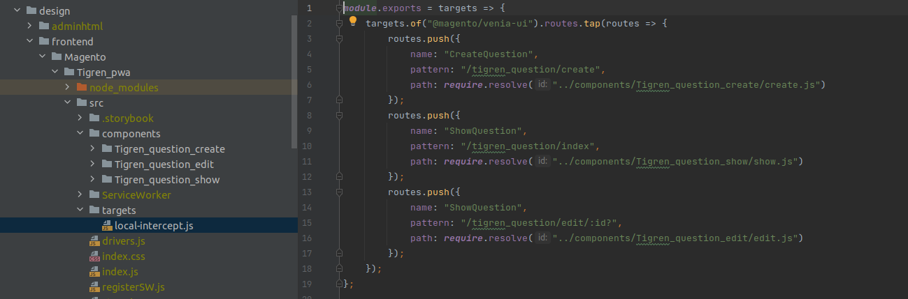

## Create a new page in pwa venia sample data.

## URL for listing page: tigren_question/index
## URL for create page: tigren_question/create
## URL for edit page: tigren_question/edit

## Table tigren_customer_question: created_at, updated_at, customer_name, title, content

## When a customer submits the form. Please create graphql to save them

## When show listing. Have to use graphql to show them

## Make sure you have a pager for listing page

